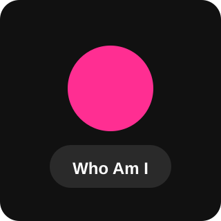

 

> *"I'm not here to just make things work, I'm here to know why they do."*

---

### Who Am I?

A Computer Science sophomore who treats learning like a main quest. My philosophy: **you must feel connected to the stuff you build.**

I care less about how many things I've built and more about how deeply I understand them — the *why* behind every concept, the *how* beneath every abstraction. Whether it's low-level memory management in C++, POSIX shared memory across processes, or why a build breaks, I want to understand it from the inside out.

I also believe code and art aren't opposites. I bring the same attention to detail I'd put into a design into the systems I build.

At the moment I'm deep in the web ecosystem — React, Next.js, TypeScript, Supabase — shipping full-stack projects front to back, with AI/ML next on the list once this stretch wraps up.

**Quality over quantity. Always.**

 

---

## 🎯 Current Mission

| Status | Quest |
|--------|-------|
| `[ACTIVE]` | Deep in the web ecosystem this summer — React, Vite, Next.js, TypeScript, Supabase |
| `[ACTIVE]` | Shipping full-stack projects front to back |
| `[NEXT]` | Circling back to AI/ML — the math, the models, the meaning |
| `[ONGOING]` | Learning how things break, so I know exactly why they work |

---

## 🛠️ Tech Stack

**Web Ecosystem**

**Languages**

**Databases & Tools**

**Machine Learning**

**Creative**

---

## Featured Projects

<table>
<tr>
<td width="50%">

</td>
<td width="50%">

</td>
</tr>
<tr>
<td width="50%">

</td>
<td width="50%">

</td>
</tr>
<tr>
<td width="50%">

</td>
<td width="50%"></td>
</tr>
</table>

---

## 📊 GitHub Stats

---

## 🌐 Find Me

---

*Currently somewhere between a bug and a breakthrough.*

