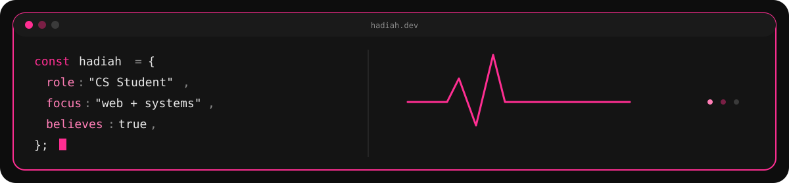
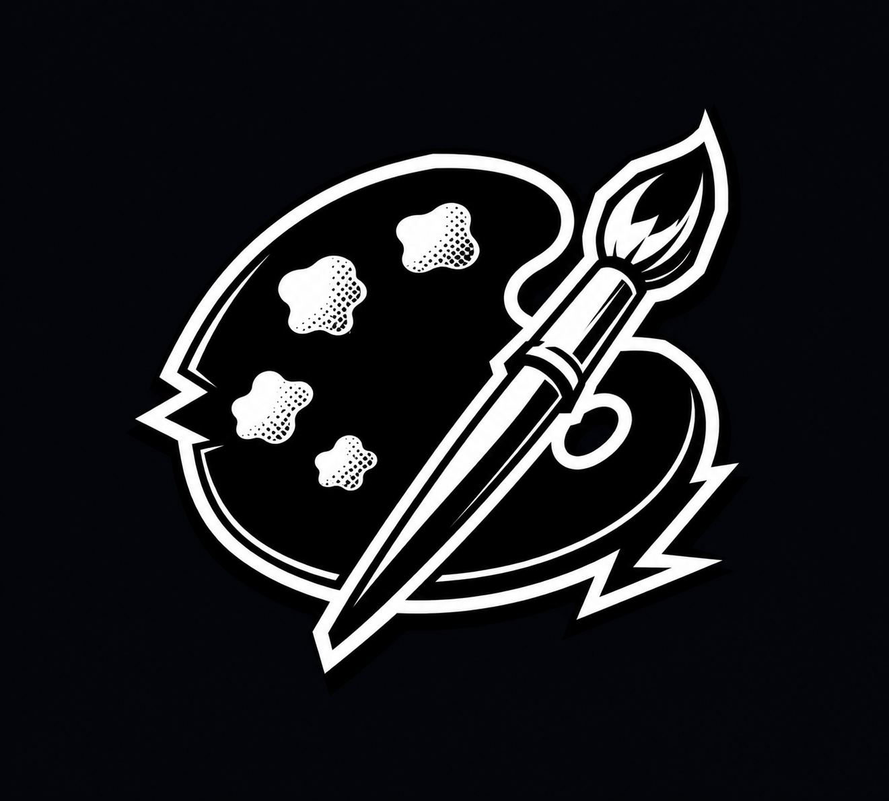
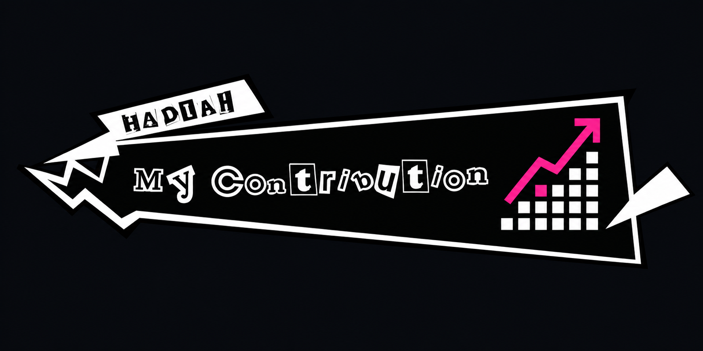

<!--
  GitHub: https://github.com/Hadiah-Batool
-->

<!-- ─── BANNER ─────────────────────────────────────────────── -->

  
  
  

 

<!-- ─── TYPING SVG ─────────────────────────────────────────── -->

  

 

<!-- ─── WHO AM I ───────────────────────────────────────────── -->

**Who Am I?**

A **Computer Science sophomore** who treats learning like a main quest. My philosophy: `you must feel connected to the stuff you build.`

I care less about how many things I've built and more about how **deeply I understand them** — the *why* behind every concept, the *how* beneath every abstraction. Whether it's low-level memory management or front-end polish, I like knowing what's happening under the hood.

I also believe code and art aren't opposites. I bring the same **attention to detail** I'd put into a design into the systems I build.

At the moment I'm deep in the `web ecosystem` — React, Next.js, TypeScript, Supabase — shipping full-stack projects front to back, with **AI/ML** next on the list once this stretch wraps up.

**Quality over quantity. Always.**

 
 

<!-- ─── CURRENT MISSION ────────────────────────────────────── -->

### 🎯 Current Mission

| Status | Quest |
|:--|:--|
| `[ACTIVE]` 🔥 | Deep in the web ecosystem this summer — React, Vite, Next.js, TypeScript, Supabase 🚀 |
| `[ACTIVE]` ⚡ | Shipping full-stack projects front to back 🛠️ |
| `[NEXT]` 🧠 | Circling back to AI/ML — the math, the models, the meaning 🤖 |
| `[ONGOING]` 🎯 | Learning how things break, so I know exactly why they work 🔍 |

 

> [!NOTE]
>
> Code is never finished, it only gets **better**.
>
> Built with **curiosity**, **precision**, and **persistence**.

 

<!-- ─── STACK + STATS ──────────────────────────────────────── -->
<table align="center">
  <tr>
    <!-- Skills Left -->
    <td valign="top" width="48%">

**🛠️ Tech Stack**

`Web Ecosystem`

  
  
  
  
  
  
  
  

`Languages`

  
  
  
  
  
  
  

`Databases & Tools`

  
  
  
  
  

`Machine Learning`

  
  
  

`Creative`

  
  

**📊 GitHub Stats**

    </td>
  </tr>
</table>

 

<!-- ─── CONTRIBUTIONS ──────────────────────────────────────── -->

  

  

 

<!-- ─── FEATURED PROJECTS ──────────────────────────────────── -->

### 🗂️ Featured Projects

<table>
  <tr>
    <td width="50%" valign="top">
      <a href="https://github.com/Hadiah-Batool/Chrono_Rift"><b>⚔️ Chrono_Rift</b></a> 
      <code>C++</code> <code>SFML</code> <code>POSIX</code> 
      3-process turn-based RPG engine — shared memory IPC, deadlock-detection watchdog, signal handling
    </td>
    <td width="50%" valign="top">
      <a href="https://github.com/Hadiah-Batool/DSA-Visualizer"><b>🎨 DSA-Visualizer</b></a> 
      <code>Python</code> <code>Pygame</code> 
      Interactive DSA visualizer with custom pixel art — 45+ stars, 345K+ LinkedIn impressions
    </td>
  </tr>
  <tr>
    <td width="50%" valign="top">
      <a href="https://github.com/Hashimk101/Indicium"><b>🧩 Indicium</b></a> 
      <code>Java</code> <code>JavaFX</code> <code>MySQL</code> 
      Forensic case management system — SHA-256 auth, role-based access, audited admin panel
    </td>
    <td width="50%" valign="top">
      <a href="https://github.com/Hashimk101/Smart-City-DS-Project"><b>🏙️ Smart-City-DS-Project</b></a> 
      <code>C++</code> 
      City simulation built with manual memory management, zero STL
    </td>
  </tr>
  <tr>
    <td colspan="2" valign="top" align="center">
      <a href="https://github.com/Hadiah-Batool/OOP_Project"><b>🧠 OOP_Project</b></a> 
      <code>C++</code> 
      OOP coursework — inheritance, polymorphism, clean architecture
    </td>
  </tr>
</table>

 

<!-- ─── CONNECT ────────────────────────────────────────────── -->

  <strong>You can Click here</strong>
    

  
  

 

---

  <i>Currently somewhere between a bug and a breakthrough.</i>

